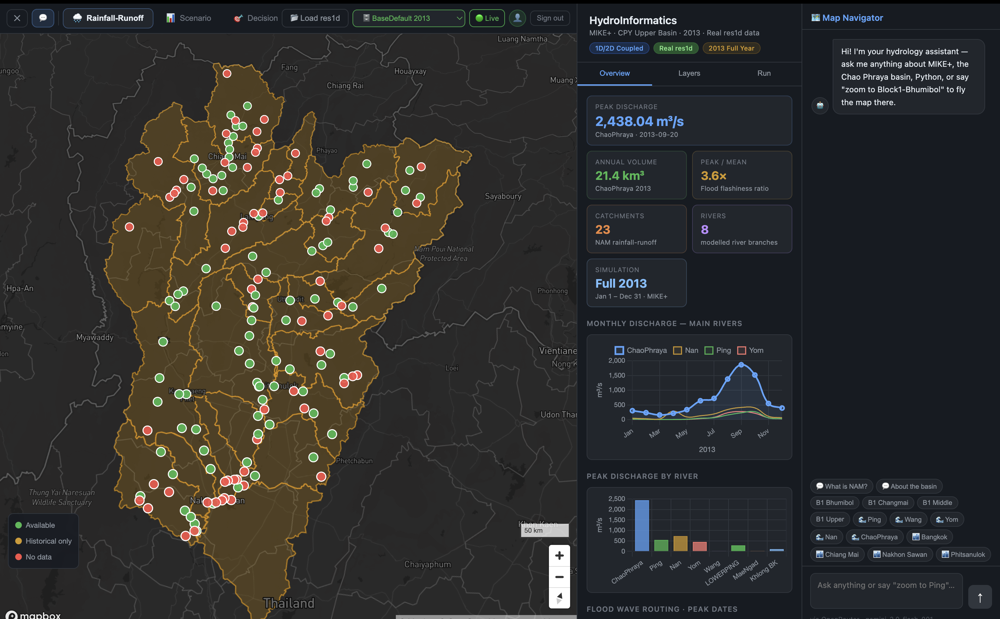

# Hydroinformatics Platform

A portfolio case study of a web-based hydroinformatics platform using MIKE+ workflows for geospatial visualization, simulation scenario management, and environmental time-series analysis.

> Note: This repository is a public case study. The full production source code, client data, model files, and credentials are not included.
>
## Screenshots

### Dashboard


## Overview

This platform was designed to support water management workflows by combining GIS visualization, MIKE+ hydrological simulation data, and interactive dashboards. The system helps users explore simulation scenarios, inspect time-series results, and understand spatial water-related data through a web interface.

## Key Features

- Interactive GIS map for water infrastructure and station visualization
- MIKE+ simulation scenario management
- Gantt-style timeline for simulation start and end dates
- Time-series charts for water level, discharge, rainfall, and related variables
- DFS0 time-series generation and editing workflows
- Backend API integration for MIKE+ model data and simulation metadata
- Dashboard interface for monitoring and decision support

## Tech Stack

### Frontend
- Next.js
- React
- TypeScript
- Tailwind CSS
- Mapbox / MapLibre
- Recharts

### Backend
- FastAPI
- Python
- PostgreSQL
- SQLite
- REST API

### Data & Simulation
- MIKE+ workflows
- DFS0 / RES1D time-series processing
- Hydrological simulation metadata
- Geospatial datasets
- Environmental monitoring data

### Infrastructure
- Cloudflare Tunnel
- Nginx
- Docker-ready backend structure

## Architecture

```text
User Interface
   ↓
Next.js Frontend
   ↓
REST API
   ↓
FastAPI Backend
   ↓
PostgreSQL / SQLite / MIKE+ Model Files
   ↓
Hydrological Simulation Data
